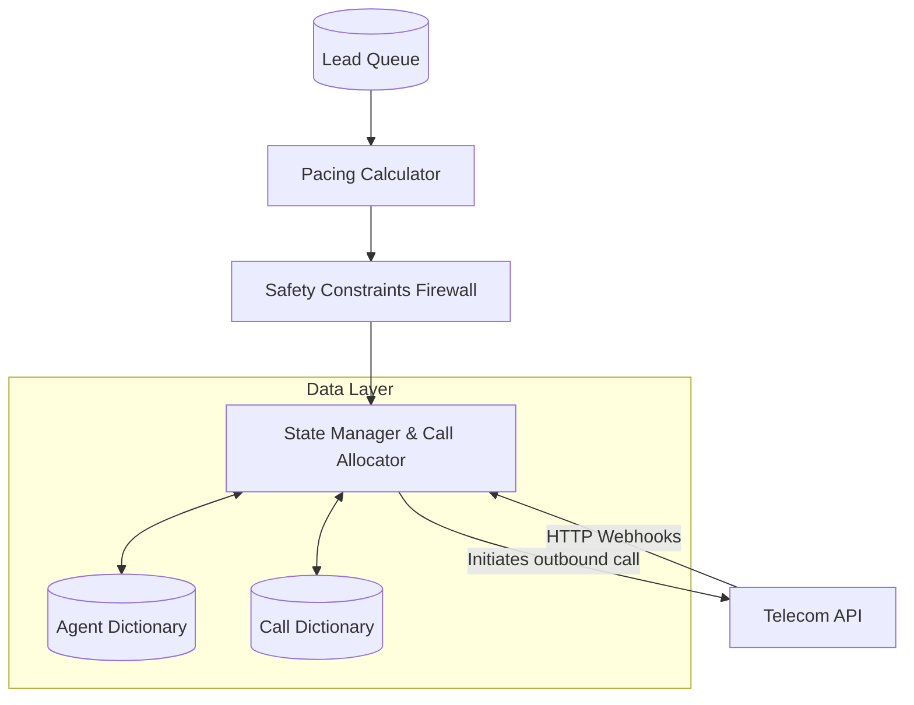

# Architecture Decision Record: SmartDialer

## System Flow

## Core Technology Choices

### Platform Selection
The entire solution is engineered using **Python** and its native **asyncio** library. The data persistence layer is intentionally kept as in-memory dictionaries for this prototype phase, heavily relying on `asyncio.Lock` and logical version numbers to emulate Compare-And-Swap (CAS) semantics.

### Rationale
The primary goal of this assignment is proving structural correctness—preventing race conditions, handling malformed network events, and enforcing hard safety limits. 
By utilizing Python's `asyncio` event loop instead of immediately reaching for enterprise tools like Kafka or Postgres, the underlying logic is forced to the surface. It proves that the application can natively handle logical idempotency (ignoring duplicate webhook events) and enforce monotonic state transitions directly in the code, rather than hoping a database unique constraint will save the day. Additionally, the async loop is exceptionally fast for lightweight state changes, easily processing thousands of events per second in a single thread.

### Trade-offs and Limitations
The obvious drawback of an entirely in-memory, single-threaded architecture is horizontal scaling. You cannot simply spin up ten instances of this application behind a load balancer because they won't share the same `DataStore`.

If we needed to abruptly scale this to manage 100,000 active agents across multiple server nodes, the `asyncio` loop would inevitably become a CPU bottleneck, and the lack of shared state would fracture the system. 
To resolve that scaling limit, the `DataStore` class would need to be swapped out for **Redis** (handling rapid PubSub events and caching) and **PostgreSQL** (acting as the permanent source of truth). We would use Redis Lua scripts to maintain the atomic Compare-And-Swap agent reservation behavior we currently have in Python.

## Blending Predictive Utilization with Progressive Safety

**The Prompt:** *How would you build a SmartDialer that gets as much of the utilization benefit of predictive dialing as possible, while retaining the deterministic safety characteristics of progressive dialing?*

The solution lies in maintaining a strict, physical separation of concerns between the predictive algorithm and the call execution layer. 

1. **The Predictor (Pacing Logic)**
   This component is mathematically aggressive. It looks at historical talk times, current ringing calls, and drop rates to generate a raw integer of "desired outbound dials." It is allowed to be wrong, and it is allowed to take risks.
   
2. **The Governor (Safety Controller)**
   This component sits directly between the Predictor and the Call Allocator. It acts as an absolute, deterministic firewall. Regardless of what the Predictor asks for, the Governor evaluates real-time, hard metrics (e.g., "Is our trailing 5-minute abandon rate currently above 3%?"). 
   - If the metrics are clean, it permits the Predictor's aggressive volume. 
   - The exact millisecond the compliance thresholds are breached, or if the telecom provider begins timing out, the Governor instantly clamps the dial request down to a 1:1 ratio (Progressive Mode) or outright zeroes it.

By isolating these two concepts, you give the statistical model room to chase maximum utilization, entirely secured by the knowledge that the deterministic firewall will physically prevent it from violating compliance thresholds.
