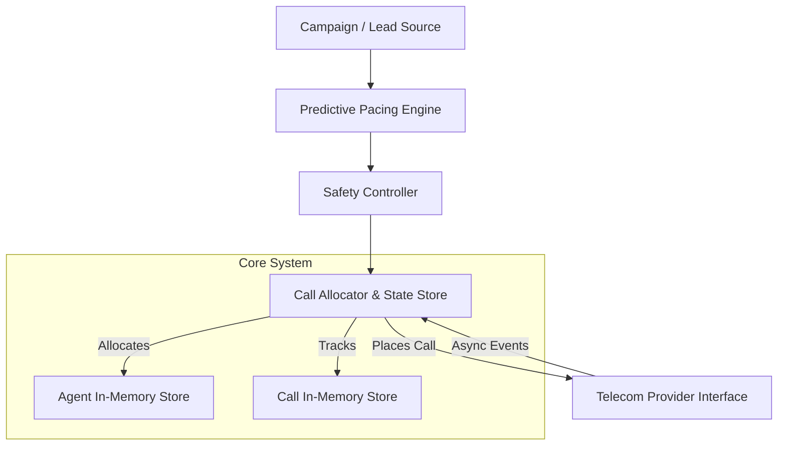

# SmartDialer Architecture & Decisions

## Architecture Diagram

## Architectural Decisions

### What did you choose?
I chose to build the system entirely in **Python** using **asyncio**. The data layer uses an in-memory `DataStore` (dictionaries) with explicitly modeled concurrency using `asyncio.Lock` and logical versioning (Compare-And-Swap simulation).

### Why did you choose it?
This tech assignment is about demonstrating concurrency control, safety bounds, and state machine transitions. Using Python and `asyncio` allows for thousands of concurrent mock network calls to run in a single thread, heavily stressing the state transition logic without needing to deploy Kafka, Redis, or PostgreSQL. A single-threaded event loop forces the developer to handle logical idempotency (duplicate events) and monotonic state transitions explicitly in the code.

### What problem does it solve?
It solves the core requirement of the assignment: **Correctness before cleverness**. 
- **Concurrency (Two workers reserving the same agent)** is prevented by assigning a `version` integer to the agent state. When a reservation is attempted, we check `current_version == expected_version`. If a concurrent routine already reserved the agent, the version bumps, and the second routine's reservation fails (CAS).
- **Out of Order Events / Duplicates** are solved by tracking `events_seen` on the call object (idempotency) and enforcing monotonic state progression (e.g. you cannot go from `CONNECTED` back to `INITIATED`).

### What does it make harder?
Scaling beyond a single machine. Because the datastore is in-memory and relies on `asyncio.Lock`, you cannot easily run 10 separate Docker containers handling 100,000 agents. At that scale, you would break first on CPU bound processing of the asyncio event loop or run out of memory. 
To scale horizontally, the `DataStore` would need to be replaced with Redis (for state caching and PubSub) and PostgreSQL (for persistent state logging), using Redis Lua scripts or optimistic locking to recreate the CAS behavior.

## Final Question
**How would you build a SmartDialer that gets as much of the utilization benefit of predictive dialing as possible, while retaining the deterministic safety characteristics of progressive dialing?**

You achieve this by firmly decoupling the **Pacing Logic (Prediction)** from the **Safety Bounds (Deterministic Limits)**.

1. **The Pacing Engine** is allowed to be aggressive. It uses statistical models (average answer rate, average call duration, historical drop rates) to predict that we need 15 dials to connect 5 calls. It outputs a requested number.
2. **The Safety Controller** acts as an impermeable firewall. Before those 15 dials are handed to the Allocator, the Safety Controller evaluates the current real-world metrics.
   - If the trailing 5-minute abandon rate exceeds compliance limits (e.g., 3%), the Safety Controller immediately truncates the request from 15 down to the number of strictly available agents (Progressive Mode).
   - If provider failure rates spike, it drops the request to 0.

By enforcing the boundary at the Safety Controller, the prediction algorithm can iterate and take risks, knowing that the Safety Controller will forcibly clamp its output back to Progressive safety constraints the moment real-world reality deviates from the prediction.
